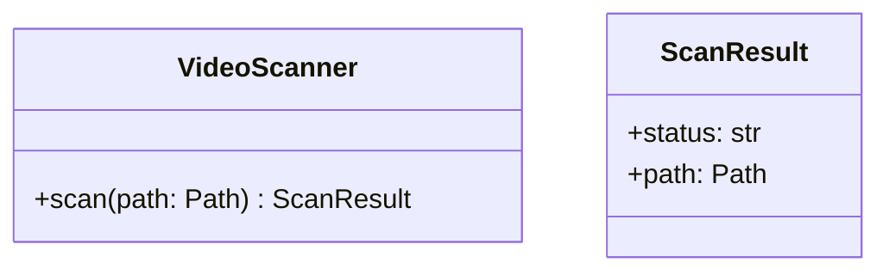
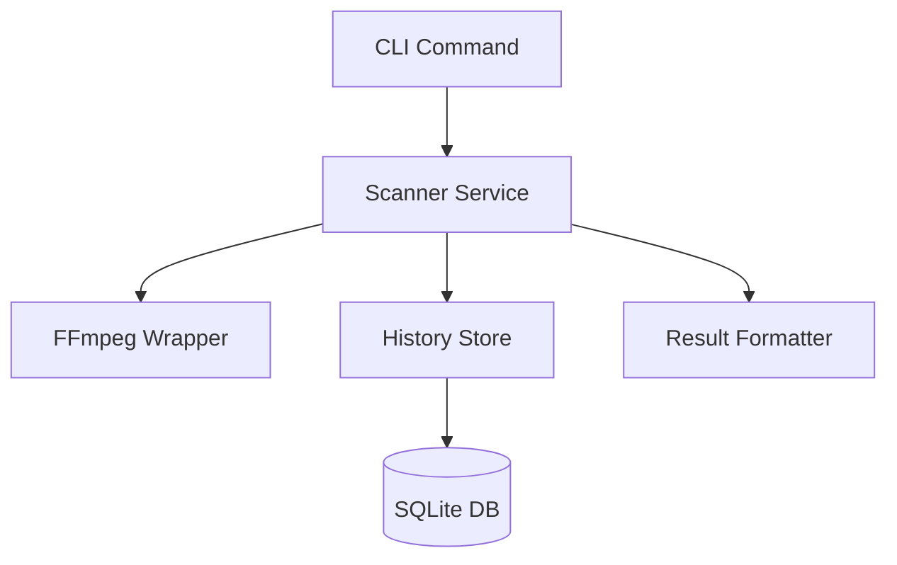

# Feature Development Skill

This skill provides comprehensive guidance for designing and implementing new features in the Corrupt Video File Inspector project.

## Required Tools

### Allowed Tools

**Development Tools (REQUIRED)**
- `python` - Python interpreter (3.13+)
- `pip` / `poetry` - Dependency management
- `black` - Code formatting
- `ruff` - Linting
- `mypy` - Type checking
- `pytest` - Testing

**Design Tools (RECOMMENDED)**
- `mermaid` - Architecture diagrams (text-based)
- UML in markdown - Class diagrams

**Database Tools (When Needed)**
- `sqlite3` - SQLite operations
- SQL migrations scripts

**What to Use:**
```bash
# ✅ DO: Use project-standard development tools
python -m pytest tests/
black src/ tests/
ruff check src/
mypy src/

# ✅ DO: Use mermaid for architecture diagrams


# ✅ DO: Use SQLite for data persistence
sqlite3 scan_history.db ".schema"
```

**What NOT to Use:**
```bash
# ❌ DON'T: Use unapproved external services
# Without explicit approval:
- External APIs for core functionality
- Cloud services (AWS, GCP, Azure)
- Third-party SaaS platforms

# ❌ DON'T: Use heavyweight databases
postgresql              # Use SQLite for local storage
mongodb                 # Use SQLite
redis                   # Use SQLite or in-memory dict

# ❌ DON'T: Use non-standard Python tools
pipenv                  # Use poetry or pip
conda                   # Use pip/poetry
```

### Tool Usage Examples

**Example 1: Design Feature Architecture**
```markdown
## Architecture Design



### Components
- **Scanner Service**: Coordinates scanning logic
- **FFmpeg Wrapper**: Executes video analysis
- **History Store**: Manages scan history
```

**Example 2: Implement with Type Safety**
```python
from typing import Protocol, Optional
from pathlib import Path
from datetime import datetime

class ScanHistoryStore(Protocol):
    """Protocol for scan history storage."""
    
    def get_last_scan(self, path: Path) -> Optional[datetime]:
        """Get timestamp of last scan."""
        ...
    
    def record_scan(
        self,
        path: Path,
        status: str,
        timestamp: datetime
    ) -> None:
        """Record scan result."""
        ...

class SQLiteScanHistory:
    """SQLite implementation of scan history."""
    
    def __init__(self, db_path: Path) -> None:
        self.db_path = db_path
        self._init_db()
    
    def _init_db(self) -> None:
        """Initialize database schema."""
        import sqlite3
        conn = sqlite3.connect(self.db_path)
        conn.execute("""
            CREATE TABLE IF NOT EXISTS scans (
                path TEXT PRIMARY KEY,
                status TEXT NOT NULL,
                timestamp REAL NOT NULL
            )
        """)
        conn.commit()
        conn.close()
```

**Example 3: Test Feature Implementation**
```python
import pytest
from pathlib import Path

@pytest.mark.unit
def test_scan_history_stores_result(tmp_path: Path) -> None:
    """Test scan history storage."""
    db_path = tmp_path / "test.db"
    history = SQLiteScanHistory(db_path)
    
    # Record scan
    test_path = Path("/test.mp4")
    history.record_scan(test_path, "healthy", datetime.now())
    
    # Verify stored
    last_scan = history.get_last_scan(test_path)
    assert last_scan is not None
```

**Example 4: Integrate with Configuration**
```python
from pydantic import BaseModel, Field

class IncrementalScanConfig(BaseModel):
    """Configuration for incremental scanning."""
    
    enabled: bool = Field(
        default=False,
        description="Enable incremental scanning"
    )
    
    database_path: Path = Field(
        default=Path(".scan_history.db"),
        description="Path to scan history database"
    )
    
    max_age_days: int = Field(
        default=30,
        gt=0,
        description="Maximum age of cached scans"
    )
```

## When to Use

Use this skill when:
- Implementing new features from requirements
- Building new modules or components
- Designing complex functionality
- Adding significant capabilities
- Integrating external services

## Feature Development Lifecycle

### 1. Requirements Analysis

**Understand the Feature**
- What problem does it solve?
- Who are the users?
- What are the acceptance criteria?
- What are the constraints?
- What are the dependencies?

**Example Analysis**
```markdown
Feature: Incremental Video Scanning

Problem: Full scans take too long for large libraries
Users: End users with large video collections
Criteria:
  - Only scan videos modified since last scan
  - Track scan history in database
  - Provide --incremental flag
Constraints:
  - Must maintain backward compatibility
  - Database must be optional
Dependencies:
  - SQLite for scan history
  - File modification time detection
```

### 2. Design Phase

**Architecture Design**
```python
# Define interfaces first
from typing import Protocol
from pathlib import Path
from datetime import datetime

class ScanHistoryStore(Protocol):
    """Interface for scan history storage."""
    
    def get_last_scan(self, path: Path) -> Optional[datetime]:
        """Get last scan time for a video file."""
        ...
    
    def record_scan(
        self,
        path: Path,
        status: str,
        timestamp: datetime
    ) -> None:
        """Record a scan result."""
        ...

# Concrete implementation
class SQLiteScanHistory:
    """SQLite-based scan history storage."""
    
    def __init__(self, db_path: Path):
        self.db_path = db_path
        self._init_database()
    
    def _init_database(self) -> None:
        """Initialize database schema."""
        ...
    
    def get_last_scan(self, path: Path) -> Optional[datetime]:
        """Get last scan time from database."""
        ...
    
    def record_scan(
        self,
        path: Path,
        status: str,
        timestamp: datetime
    ) -> None:
        """Record scan in database."""
        ...
```

**Design Patterns to Consider**
- Strategy Pattern: For interchangeable algorithms
- Factory Pattern: For object creation
- Observer Pattern: For event notification
- Decorator Pattern: For adding functionality
- Dependency Injection: For loose coupling

### 3. Implementation Phase

**Module Structure**
```
src/
├── feature_name/
│   ├── __init__.py           # Public API
│   ├── models.py             # Data models
│   ├── service.py            # Business logic
│   ├── storage.py            # Data persistence
│   └── exceptions.py         # Custom exceptions
└── tests/
    └── unit/
        └── test_feature_name/
            ├── test_models.py
            ├── test_service.py
            └── test_storage.py
```

**Implementation Standards**

**Type Annotations (REQUIRED)**
```python
from typing import List, Optional, Dict, Any
from pathlib import Path
from datetime import datetime

def scan_incremental(
    directory: Path,
    history: ScanHistoryStore,
    max_age_days: int = 30
) -> List[ScanResult]:
    """Perform incremental scan of directory.
    
    Args:
        directory: Directory to scan
        history: Scan history storage
        max_age_days: Maximum age of last scan in days
        
    Returns:
        List of scan results for modified videos
        
    Raises:
        ValueError: If directory does not exist
        StorageError: If history store fails
    """
    ...
```

**Error Handling**
```python
from src.feature.exceptions import FeatureError

class IncrementalScanError(FeatureError):
    """Error during incremental scan."""
    pass

def scan_with_history(path: Path) -> ScanResult:
    """Scan with error handling."""
    try:
        return _perform_scan(path)
    except FileNotFoundError as e:
        logger.error(f"Video not found: {path}")
        raise IncrementalScanError(
            f"Cannot scan missing file: {path}"
        ) from e
    except Exception as e:
        logger.exception(f"Unexpected error scanning {path}")
        raise IncrementalScanError(
            f"Scan failed for {path}: {e}"
        ) from e
```

**Configuration Integration**
```python
from pydantic import BaseModel, Field

class IncrementalScanConfig(BaseModel):
    """Configuration for incremental scanning."""
    
    enabled: bool = Field(
        default=False,
        description="Enable incremental scanning"
    )
    
    max_age_days: int = Field(
        default=30,
        gt=0,
        description="Maximum age of cached scan in days"
    )
    
    database_path: Path = Field(
        default=Path(".scan_history.db"),
        description="Path to scan history database"
    )

# Add to main config
class Config(BaseModel):
    # ... existing config
    incremental: IncrementalScanConfig = Field(
        default_factory=IncrementalScanConfig
    )
```

**Logging**
```python
import logging

logger = logging.getLogger(__name__)

def process_feature() -> None:
    """Process with proper logging."""
    logger.info("Starting feature processing")
    
    try:
        result = perform_operation()
        logger.info(
            f"Feature processing complete: {result.summary}"
        )
    except FeatureError as e:
        logger.error(f"Feature processing failed: {e}")
        raise
```

### 4. Testing Phase

**Test Structure**
```python
# tests/unit/test_incremental_scan.py
import pytest
from pathlib import Path
from datetime import datetime, timedelta
from src.incremental import (
    SQLiteScanHistory,
    scan_incremental,
    IncrementalScanError
)

@pytest.fixture
def scan_history(tmp_path: Path) -> SQLiteScanHistory:
    """Provide scan history storage."""
    db_path = tmp_path / "test_history.db"
    return SQLiteScanHistory(db_path)

@pytest.fixture
def sample_videos(tmp_path: Path) -> List[Path]:
    """Create sample video files."""
    videos = []
    for i in range(3):
        video = tmp_path / f"video_{i}.mp4"
        video.touch()
        videos.append(video)
    return videos

@pytest.mark.unit
def test_incremental_scan_skips_recent_scans(
    scan_history: SQLiteScanHistory,
    sample_videos: List[Path]
) -> None:
    """Test that recently scanned videos are skipped."""
    # Arrange: Record recent scan
    video = sample_videos[0]
    recent_time = datetime.now() - timedelta(days=1)
    scan_history.record_scan(video, "healthy", recent_time)
    
    # Act: Perform incremental scan
    results = scan_incremental(
        sample_videos[0].parent,
        scan_history,
        max_age_days=30
    )
    
    # Assert: Recently scanned video skipped
    scanned_paths = [r.path for r in results]
    assert video not in scanned_paths

@pytest.mark.unit
def test_incremental_scan_includes_old_scans(
    scan_history: SQLiteScanHistory,
    sample_videos: List[Path]
) -> None:
    """Test that old scans are re-scanned."""
    # Arrange: Record old scan
    video = sample_videos[0]
    old_time = datetime.now() - timedelta(days=60)
    scan_history.record_scan(video, "healthy", old_time)
    
    # Act: Perform incremental scan
    results = scan_incremental(
        sample_videos[0].parent,
        scan_history,
        max_age_days=30
    )
    
    # Assert: Old scan included
    scanned_paths = [r.path for r in results]
    assert video in scanned_paths

@pytest.mark.unit
def test_incremental_scan_handles_missing_history(
    scan_history: SQLiteScanHistory,
    sample_videos: List[Path]
) -> None:
    """Test handling of videos with no scan history."""
    # Arrange: No history recorded
    
    # Act: Perform incremental scan
    results = scan_incremental(
        sample_videos[0].parent,
        scan_history,
        max_age_days=30
    )
    
    # Assert: All videos scanned
    assert len(results) == len(sample_videos)

@pytest.mark.unit
def test_incremental_scan_error_handling(
    scan_history: SQLiteScanHistory
) -> None:
    """Test error handling for invalid directory."""
    # Arrange: Non-existent directory
    invalid_dir = Path("/nonexistent/directory")
    
    # Act & Assert: Should raise error
    with pytest.raises(IncrementalScanError):
        scan_incremental(invalid_dir, scan_history)
```

**Integration Tests**
```python
# tests/integration/test_incremental_workflow.py
import pytest
from pathlib import Path

@pytest.mark.integration
def test_full_incremental_workflow(
    tmp_path: Path,
    sample_config: Config
) -> None:
    """Test complete incremental scan workflow."""
    # Create test videos
    video_dir = tmp_path / "videos"
    video_dir.mkdir()
    
    videos = []
    for i in range(5):
        video = video_dir / f"test_{i}.mp4"
        video.touch()
        videos.append(video)
    
    # First scan: All videos scanned
    results1 = scan_directory(
        video_dir,
        sample_config,
        incremental=True
    )
    assert len(results1) == 5
    
    # Second scan immediately: No videos scanned
    results2 = scan_directory(
        video_dir,
        sample_config,
        incremental=True
    )
    assert len(results2) == 0
    
    # Modify one video
    videos[0].touch()
    
    # Third scan: Only modified video scanned
    results3 = scan_directory(
        video_dir,
        sample_config,
        incremental=True
    )
    assert len(results3) == 1
    assert results3[0].path == videos[0]
```

### 5. Documentation Phase

**Feature Documentation**
```markdown
# Incremental Scanning

## Overview

Incremental scanning only processes videos that have been modified since the last scan, significantly reducing scan time for large libraries.

## Configuration

Add to your `config.yaml`:

\`\`\`yaml
incremental:
  enabled: true
  max_age_days: 30
  database_path: .scan_history.db
\`\`\`

## Usage

### CLI

\`\`\`bash
# Enable incremental scanning
corrupt-video-inspector scan /videos --incremental

# Disable incremental scanning
corrupt-video-inspector scan /videos --no-incremental
\`\`\`

### Python API

\`\`\`python
from pathlib import Path
from src.scanner import VideoScanner
from src.config import Config

config = Config.load()
config.incremental.enabled = True

scanner = VideoScanner(config)
results = scanner.scan_directory(
    Path("/videos"),
    incremental=True
)
\`\`\`

## How It Works

1. **History Tracking**: Scan results are stored in SQLite database
2. **Modification Detection**: File modification times are compared
3. **Selective Scanning**: Only modified or new files are scanned
4. **Configurable Age**: Control how long scans are cached

## Performance

For a library of 1000 videos:
- Full scan: ~30 minutes
- Incremental scan (0 changes): ~5 seconds
- Incremental scan (10 changes): ~30 seconds

## Limitations

- Requires write access for database file
- File renames are treated as new files
- Moving files triggers re-scan
```

**API Documentation**
```python
def scan_incremental(
    directory: Path,
    history: ScanHistoryStore,
    max_age_days: int = 30,
    extensions: List[str] = None
) -> List[ScanResult]:
    """Perform incremental scan of video directory.
    
    Only scans videos that have been modified since the last scan
    or have no scan history. Uses file modification time to detect
    changes.
    
    Args:
        directory: Directory containing videos to scan
        history: Scan history storage implementation
        max_age_days: Maximum age of cached scan in days.
            Videos scanned more than max_age_days ago will be
            re-scanned even if not modified. Default: 30
        extensions: List of video file extensions to scan.
            Default: [".mp4", ".mkv", ".avi", ".mov"]
    
    Returns:
        List of ScanResult objects for videos that were scanned.
        Empty list if no videos needed scanning.
    
    Raises:
        ValueError: If directory does not exist or is not a directory
        StorageError: If scan history storage fails
        IncrementalScanError: If scan operation fails
    
    Examples:
        Basic usage:
        >>> from pathlib import Path
        >>> from src.incremental import (
        ...     scan_incremental, SQLiteScanHistory
        ... )
        >>> history = SQLiteScanHistory(Path(".history.db"))
        >>> results = scan_incremental(
        ...     Path("/videos"),
        ...     history
        ... )
        >>> print(f"Scanned {len(results)} videos")
        
        Custom max age:
        >>> results = scan_incremental(
        ...     Path("/videos"),
        ...     history,
        ...     max_age_days=7  # Re-scan after 7 days
        ... )
    
    Notes:
        - File modification time is used to detect changes
        - Renamed files are treated as new files
        - Database must be writable
        - First scan will process all files
    
    See Also:
        - scan_directory: Regular directory scanning
        - SQLiteScanHistory: Default history storage
    """
    ...
```

### 6. Integration Phase

**CLI Integration**
```python
# src/cli/commands.py
import typer

@app.command()
def scan(
    directory: Path,
    incremental: bool = typer.Option(
        False,
        "--incremental/--no-incremental",
        help="Use incremental scanning"
    ),
    max_age_days: int = typer.Option(
        30,
        help="Maximum age of cached scans in days"
    )
) -> None:
    """Scan directory for corrupt videos.
    
    Examples:
        Incremental scan:
        $ corrupt-video-inspector scan /videos --incremental
        
        Full scan:
        $ corrupt-video-inspector scan /videos --no-incremental
    """
    config = Config.load()
    
    if incremental:
        config.incremental.enabled = True
        config.incremental.max_age_days = max_age_days
    
    scanner = VideoScanner(config)
    results = scanner.scan_directory(directory)
    
    # Display results
    ...
```

**Configuration Update**
```yaml
# config.sample.yaml
incremental:
  # Enable incremental scanning (only scan modified files)
  enabled: false
  
  # Maximum age of cached scan results in days
  # Files scanned more than max_age_days ago will be re-scanned
  max_age_days: 30
  
  # Path to scan history database
  # Relative paths are relative to config file location
  database_path: .scan_history.db
```

**CHANGELOG Update**
```markdown
## [Unreleased]

### Added
- Incremental scanning feature for faster re-scans of large libraries
- `--incremental` flag for CLI scan command
- SQLite-based scan history tracking
- Configuration options for incremental scanning
```

## SOLID Principles in Practice

### Single Responsibility Principle

Each class should have one reason to change:

```python
# Good: Separate responsibilities
class VideoScanner:
    """Scans videos for corruption."""
    def scan(self, path: Path) -> ScanResult: ...

class ScanHistoryStore:
    """Stores scan history."""
    def record_scan(self, path: Path, result: ScanResult) -> None: ...

class IncrementalScanner:
    """Coordinates incremental scanning."""
    def __init__(
        self,
        scanner: VideoScanner,
        history: ScanHistoryStore
    ):
        self.scanner = scanner
        self.history = history
```

### Open/Closed Principle

Open for extension, closed for modification:

```python
# Base class
class ScanHistoryStore(Protocol):
    """Abstract scan history storage."""
    def record_scan(self, path: Path, result: ScanResult) -> None: ...

# Extensions without modifying base
class SQLiteScanHistory:
    """SQLite implementation."""
    def record_scan(self, path: Path, result: ScanResult) -> None: ...

class RedisScanHistory:
    """Redis implementation."""
    def record_scan(self, path: Path, result: ScanResult) -> None: ...
```

### Liskov Substitution Principle

Subtypes must be substitutable:

```python
def process_with_history(
    scanner: VideoScanner,
    history: ScanHistoryStore  # Any implementation works
) -> List[ScanResult]:
    """Process using any history store."""
    ...

# Both work the same way
sqlite_history = SQLiteScanHistory(db_path)
redis_history = RedisScanHistory(redis_url)

results1 = process_with_history(scanner, sqlite_history)
results2 = process_with_history(scanner, redis_history)
```

### Interface Segregation Principle

Many small interfaces over one large:

```python
# Bad: Fat interface
class HistoryStore:
    def record_scan(self, ...): ...
    def get_last_scan(self, ...): ...
    def delete_history(self, ...): ...
    def export_csv(self, ...): ...
    def import_csv(self, ...): ...

# Good: Segregated interfaces
class ScanReader(Protocol):
    def get_last_scan(self, path: Path) -> Optional[datetime]: ...

class ScanWriter(Protocol):
    def record_scan(self, path: Path, result: ScanResult) -> None: ...

class HistoryExporter(Protocol):
    def export_csv(self, path: Path) -> None: ...
```

### Dependency Inversion Principle

Depend on abstractions:

```python
# Good: Depend on protocol
class IncrementalScanner:
    def __init__(
        self,
        scanner: VideoScanner,  # Protocol
        history: ScanHistoryStore  # Protocol
    ):
        self.scanner = scanner
        self.history = history

# Concrete implementations injected
scanner = FFmpegScanner()
history = SQLiteScanHistory(db_path)
incremental = IncrementalScanner(scanner, history)
```

## Common Pitfalls

### 1. Feature Creep

**Problem**: Adding too many features at once
**Solution**: Implement MVP first, iterate

### 2. Over-Engineering

**Problem**: Complex design for simple feature
**Solution**: Start simple, add complexity when needed

### 3. Insufficient Testing

**Problem**: Missing edge cases or error handling
**Solution**: Test-driven development, >80% coverage

### 4. Poor Error Handling

**Problem**: Catching all exceptions generically
**Solution**: Specific exception handling with context

### 5. Missing Documentation

**Problem**: No documentation for new feature
**Solution**: Document before marking feature complete

## Quality Checklist

- [ ] Requirements clearly understood
- [ ] Design reviewed and approved
- [ ] Type annotations on all functions
- [ ] Comprehensive unit tests (>80% coverage)
- [ ] Integration tests for workflows
- [ ] Error handling implemented
- [ ] Logging added
- [ ] Configuration integrated
- [ ] CLI integration (if applicable)
- [ ] Documentation written
- [ ] CHANGELOG.md updated
- [ ] All tests passing
- [ ] Code review completed
- [ ] Backward compatibility maintained

## References

- [SOLID Principles](https://en.wikipedia.org/wiki/SOLID)
- [Design Patterns](https://refactoring.guru/design-patterns)
- [Clean Code](https://www.oreilly.com/library/view/clean-code-a/9780136083238/)
- [Test-Driven Development](https://martinfowler.com/bliki/TestDrivenDevelopment.html)
