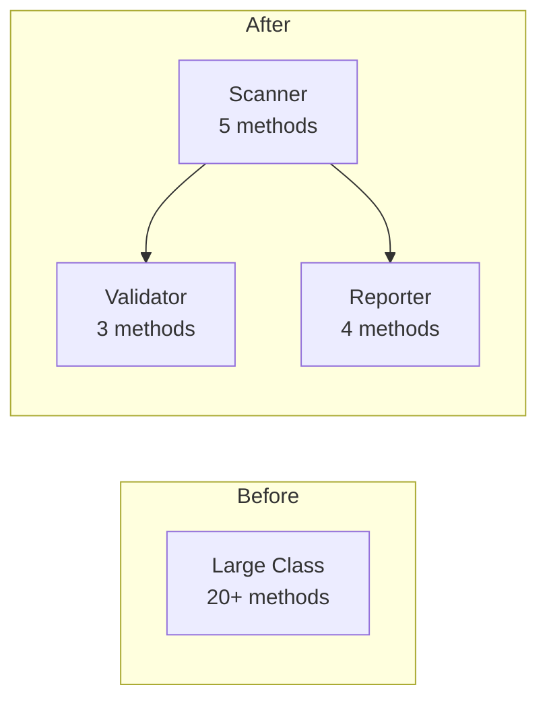

# Refactoring Skill

This skill provides comprehensive refactoring capabilities including code restructuring, architecture improvements, and technical debt reduction.

## Required Tools

### Allowed Tools

**Code Analysis (REQUIRED)**
- `radon` - Complexity analysis
- `pylint` - Additional code analysis (specific checks)
- `grep` / `view` - Code inspection
- `git diff` - Review refactoring changes

**Refactoring Tools (RECOMMENDED)**
- `rope` - Python refactoring library
- IDE refactoring features (PyCharm, VSCode)

**What to Use:**
```bash
# ✅ DO: Use complexity analysis
radon cc src/ -a           # Cyclomatic complexity
radon mi src/ -s           # Maintainability index

# ✅ DO: Find duplicate code
pylint src/ --disable=all --enable=duplicate-code

# ✅ DO: Use grep to find patterns
grep -rn "class.*:" src/   # Find all classes
grep -rn "def.*:" src/     # Find all functions

# ✅ DO: Validate with tests after each change
pytest tests/ -v
```

**What NOT to Use:**
```bash
# ❌ DON'T: Use aggressive auto-refactoring tools
# without review
autoflake --remove-all    # Too aggressive
autopep8 --aggressive     # Use black instead

# ❌ DON'T: Refactor without tests
# Always ensure tests pass before and after

# ❌ DON'T: Use external code generation
# AI code generators for bulk changes
# Code transformation services
```

### Tool Usage Examples

**Example 1: Analyze Complexity**
```bash
# Check cyclomatic complexity
radon cc src/ -a -nc

# Find functions with high complexity (>10)
radon cc src/ -n D

# Check maintainability index
radon mi src/ -s
```

**Example 2: Find Code Smells**
```bash
# Find long functions (>50 lines)
for file in src/**/*.py; do
  awk '/^def / {start=NR} /^def /||/^class / {
    if(start && NR-start>50) print FILENAME":"start
  }' "$file"
done

# Find duplicate code
pylint src/ --disable=all --enable=duplicate-code

# Find complex conditionals
grep -rn "if.*and.*or" src/
```

**Example 3: Extract Method Refactoring**
```python
# Before: Long function
def process_video(path: Path) -> ScanResult:
    # 100+ lines of mixed concerns
    # validation, scanning, error handling, reporting
    ...

# After: Extracted methods
def process_video(path: Path) -> ScanResult:
    """Process video file with specified scan mode."""
    _validate_inputs(path)
    scan_result = _perform_scan(path)
    return _generate_result(scan_result)

def _validate_inputs(path: Path) -> None:
    """Validate video path."""
    if not path.exists():
        raise FileNotFoundError(f"Video not found: {path}")

def _perform_scan(path: Path) -> RawScanResult:
    """Execute video scan."""
    scanner = get_scanner()
    return scanner.scan(path)

def _generate_result(scan_result: RawScanResult) -> ScanResult:
    """Generate final result."""
    return ScanResult(
        status=scan_result.status,
        path=scan_result.path
    )
```

**Example 4: Validate Refactoring**
```bash
# 1. Ensure tests pass before refactoring
pytest tests/ -v
git commit -m "checkpoint: tests pass"

# 2. Make refactoring change
# Edit code...

# 3. Verify tests still pass
pytest tests/ -v

# 4. Check code quality
make check

# 5. Commit if successful
git commit -m "refactor: extract method from process_video"
```

**Example 5: Architecture Improvement**


## When to Use

Use this skill when:
- Refactoring large or complex code sections
- Improving code architecture
- Reducing technical debt
- Modernizing legacy code
- Extracting reusable components
- Improving code testability

## Refactoring Principles

### The Four Rules of Simple Design

1. **Passes all tests**: Behavior must be preserved
2. **Reveals intention**: Code expresses its purpose clearly
3. **No duplication**: DRY (Don't Repeat Yourself)
4. **Minimal elements**: Fewest classes and methods needed

### Safe Refactoring Practice

**Always Follow This Sequence**
1. Ensure adequate test coverage
2. Run all tests (must pass)
3. Make one refactoring change
4. Run all tests again
5. Commit if tests pass
6. Repeat

**Never Skip Steps**
- Don't refactor without tests
- Don't make multiple changes at once
- Don't skip test runs
- Don't commit failing tests

## Code Smells and Solutions

### Long Method (>50 lines)

**Smell:**
```python
def process_video(path: Path, mode: str) -> ScanResult:
    # 100+ lines of mixed concerns
    # validation, scanning, error handling, reporting
    ...
```

**Solution: Extract Method**
```python
def process_video(path: Path, mode: str) -> ScanResult:
    """Process video file with specified scan mode."""
    _validate_inputs(path, mode)
    scan_result = _perform_scan(path, mode)
    return _generate_result(scan_result)

def _validate_inputs(path: Path, mode: str) -> None:
    """Validate video path and scan mode."""
    if not path.exists():
        raise FileNotFoundError(f"Video not found: {path}")
    if mode not in VALID_MODES:
        raise ValueError(f"Invalid mode: {mode}")

def _perform_scan(path: Path, mode: str) -> RawScanResult:
    """Execute video scan based on mode."""
    scanner = get_scanner(mode)
    return scanner.scan(path)

def _generate_result(scan_result: RawScanResult) -> ScanResult:
    """Generate final scan result from raw data."""
    return ScanResult(
        status=scan_result.status,
        path=scan_result.path,
        errors=scan_result.errors
    )
```

### Large Class (>300 lines or >10 methods)

**Smell:**
```python
class VideoProcessor:
    """Does everything related to videos."""
    
    def scan(self): ...
    def validate(self): ...
    def analyze_codec(self): ...
    def extract_metadata(self): ...
    def generate_report(self): ...
    def sync_trakt(self): ...
    def export_csv(self): ...
    def export_json(self): ...
    # 15+ more methods
```

**Solution: Extract Class**
```python
class VideoScanner:
    """Scans videos for corruption."""
    
    def scan(self, path: Path, mode: str) -> ScanResult:
        ...

class VideoAnalyzer:
    """Analyzes video properties."""
    
    def analyze_codec(self, path: Path) -> CodecInfo:
        ...
    
    def extract_metadata(self, path: Path) -> Metadata:
        ...

class ScanReporter:
    """Generates reports from scan results."""
    
    def generate_report(self, results: List[ScanResult]) -> Report:
        ...
    
    def export_csv(self, report: Report, path: Path) -> None:
        ...
    
    def export_json(self, report: Report, path: Path) -> None:
        ...

class TraktSynchronizer:
    """Synchronizes results with Trakt.tv."""
    
    def sync(self, results: List[ScanResult]) -> None:
        ...
```

### Primitive Obsession

**Smell:**
```python
def scan_video(
    path: str,
    timeout: int,
    mode: str,
    recursive: bool,
    max_workers: int
) -> dict:
    """Too many primitive parameters."""
    ...
```

**Solution: Introduce Value Objects**
```python
@dataclass(frozen=True)
class ScanOptions:
    """Configuration for video scanning."""
    mode: ScanMode
    timeout: int
    recursive: bool
    max_workers: int

def scan_video(
    path: Path,
    options: ScanOptions
) -> ScanResult:
    """Scan video with configuration object."""
    ...
```

### Feature Envy

**Smell:**
```python
class VideoReporter:
    def generate_summary(self, scan_result: ScanResult) -> str:
        """Uses scan_result data extensively."""
        return (
            f"Status: {scan_result.status}\n"
            f"Duration: {scan_result.duration}\n"
            f"Errors: {len(scan_result.errors)}\n"
            f"Path: {scan_result.path}\n"
            f"Codec: {scan_result.codec_info.name}\n"
            f"Resolution: {scan_result.video_info.resolution}"
        )
```

**Solution: Move Method**
```python
class ScanResult:
    def generate_summary(self) -> str:
        """Generate summary from scan result."""
        return (
            f"Status: {self.status}\n"
            f"Duration: {self.duration}\n"
            f"Errors: {len(self.errors)}\n"
            f"Path: {self.path}\n"
            f"Codec: {self.codec_info.name}\n"
            f"Resolution: {self.video_info.resolution}"
        )

class VideoReporter:
    def report(self, scan_result: ScanResult) -> str:
        """Generate report for scan result."""
        return scan_result.generate_summary()
```

### Data Clumps

**Smell:**
```python
def process_video(
    host: str,
    port: int,
    username: str,
    password: str,
    timeout: int
) -> None:
    """Same group of parameters appears in multiple functions."""
    ...

def upload_results(
    host: str,
    port: int,
    username: str,
    password: str,
    timeout: int,
    results: List[ScanResult]
) -> None:
    """Same parameters repeated."""
    ...
```

**Solution: Introduce Parameter Object**
```python
@dataclass(frozen=True)
class ApiConnection:
    """API connection configuration."""
    host: str
    port: int
    username: str
    password: str
    timeout: int

def process_video(connection: ApiConnection) -> None:
    """Process with connection config."""
    ...

def upload_results(
    connection: ApiConnection,
    results: List[ScanResult]
) -> None:
    """Upload with connection config."""
    ...
```

### Long Parameter List (>3 parameters)

**Smell:**
```python
def scan_video(
    path: Path,
    mode: str,
    timeout: int,
    recursive: bool,
    max_workers: int,
    output_format: str,
    include_metadata: bool
) -> ScanResult:
    """Too many parameters."""
    ...
```

**Solution: Introduce Parameter Object**
```python
@dataclass
class ScanConfiguration:
    """Video scan configuration."""
    mode: str = "quick"
    timeout: int = 30
    recursive: bool = True
    max_workers: int = 8
    output_format: str = "json"
    include_metadata: bool = True

def scan_video(
    path: Path,
    config: ScanConfiguration
) -> ScanResult:
    """Scan video with configuration."""
    ...
```

### Switch Statements / Complex Conditionals

**Smell:**
```python
def get_scanner(mode: str) -> Scanner:
    """Complex conditional logic."""
    if mode == "quick":
        return QuickScanner(timeout=30)
    elif mode == "deep":
        return DeepScanner(timeout=1800)
    elif mode == "hybrid":
        return HybridScanner(
            quick_timeout=30,
            deep_timeout=1800
        )
    else:
        raise ValueError(f"Unknown mode: {mode}")
```

**Solution: Replace with Strategy Pattern**
```python
from typing import Protocol

class ScanStrategy(Protocol):
    """Protocol for scan strategies."""
    
    def scan(self, path: Path) -> ScanResult:
        """Scan video file."""
        ...

@dataclass
class QuickScanStrategy:
    """Quick scan implementation."""
    timeout: int = 30
    
    def scan(self, path: Path) -> ScanResult:
        ...

@dataclass
class DeepScanStrategy:
    """Deep scan implementation."""
    timeout: int = 1800
    
    def scan(self, path: Path) -> ScanResult:
        ...

# Registry pattern for strategy selection
SCAN_STRATEGIES: dict[str, Type[ScanStrategy]] = {
    "quick": QuickScanStrategy,
    "deep": DeepScanStrategy,
    "hybrid": HybridScanStrategy,
}

def get_scanner(mode: str) -> ScanStrategy:
    """Get scanner for specified mode."""
    strategy_class = SCAN_STRATEGIES.get(mode)
    if strategy_class is None:
        raise ValueError(f"Unknown mode: {mode}")
    return strategy_class()
```

### Duplicate Code

**Smell:**
```python
def export_json(results: List[ScanResult], path: Path) -> None:
    """Export results to JSON."""
    try:
        with open(path, 'w') as f:
            json.dump([r.to_dict() for r in results], f)
    except Exception as e:
        logger.error(f"Failed to export JSON: {e}")
        raise

def export_csv(results: List[ScanResult], path: Path) -> None:
    """Export results to CSV."""
    try:
        with open(path, 'w') as f:
            writer = csv.DictWriter(f, fieldnames=...)
            writer.writerows([r.to_dict() for r in results])
    except Exception as e:
        logger.error(f"Failed to export CSV: {e}")
        raise
```

**Solution: Extract Common Pattern**
```python
from typing import Callable
from contextlib import contextmanager

@contextmanager
def export_context(path: Path, format_name: str):
    """Context manager for export operations."""
    try:
        with open(path, 'w') as f:
            yield f
    except Exception as e:
        logger.error(f"Failed to export {format_name}: {e}")
        raise

def export_json(results: List[ScanResult], path: Path) -> None:
    """Export results to JSON."""
    with export_context(path, "JSON") as f:
        json.dump([r.to_dict() for r in results], f)

def export_csv(results: List[ScanResult], path: Path) -> None:
    """Export results to CSV."""
    with export_context(path, "CSV") as f:
        writer = csv.DictWriter(f, fieldnames=...)
        writer.writerows([r.to_dict() for r in results])
```

## Refactoring Patterns

### Extract Method

**When**: Function is too long or does multiple things

**Steps**:
1. Identify cohesive code block
2. Extract to new method with descriptive name
3. Replace original code with method call
4. Run tests

**Example**:
```python
# Before
def process_results(results: List[ScanResult]) -> Report:
    # Filter corrupt videos
    corrupt = []
    for r in results:
        if r.status == "corrupt":
            corrupt.append(r)
    
    # Calculate statistics
    total = len(results)
    corrupt_count = len(corrupt)
    percentage = (corrupt_count / total) * 100
    
    # Generate report
    report = Report(
        total=total,
        corrupt=corrupt_count,
        percentage=percentage,
        details=corrupt
    )
    return report

# After
def process_results(results: List[ScanResult]) -> Report:
    corrupt = _filter_corrupt_videos(results)
    stats = _calculate_statistics(results, corrupt)
    return _generate_report(corrupt, stats)

def _filter_corrupt_videos(
    results: List[ScanResult]
) -> List[ScanResult]:
    """Filter corrupt videos from results."""
    return [r for r in results if r.status == "corrupt"]

def _calculate_statistics(
    results: List[ScanResult],
    corrupt: List[ScanResult]
) -> dict:
    """Calculate scan statistics."""
    total = len(results)
    corrupt_count = len(corrupt)
    return {
        "total": total,
        "corrupt": corrupt_count,
        "percentage": (corrupt_count / total) * 100
    }

def _generate_report(
    corrupt: List[ScanResult],
    stats: dict
) -> Report:
    """Generate report from statistics."""
    return Report(
        total=stats["total"],
        corrupt=stats["corrupt"],
        percentage=stats["percentage"],
        details=corrupt
    )
```

### Extract Class

**When**: Class has too many responsibilities

**Steps**:
1. Identify cohesive group of methods
2. Create new class
3. Move methods to new class
4. Update references
5. Run tests

### Introduce Parameter Object

**When**: Multiple parameters often passed together

**Steps**:
1. Create data class for parameters
2. Update function signature
3. Update all callers
4. Run tests

### Replace Conditional with Polymorphism

**When**: Complex conditionals based on type

**Steps**:
1. Create base class or protocol
2. Create subclass for each condition
3. Move conditional logic to subclasses
4. Replace conditional with polymorphic call
5. Run tests

### Move Method

**When**: Method uses another class more than its own

**Steps**:
1. Copy method to target class
2. Adjust method to work in new class
3. Update original method to delegate
4. Update callers
5. Remove original method
6. Run tests

## Testing During Refactoring

### Test-Driven Refactoring

1. **Ensure Tests Exist**: Add tests if missing
2. **Run Tests**: All must pass (green)
3. **Refactor**: Make one change
4. **Run Tests**: Verify still passing
5. **Commit**: Save progress
6. **Repeat**: Continue with next refactoring

### Characterization Tests

When refactoring legacy code without tests:

```python
@pytest.mark.unit
def test_legacy_function_current_behavior() -> None:
    """Document current behavior before refactoring."""
    # Test what the function actually does now
    # Even if it's wrong, document it
    result = legacy_function(input_data)
    assert result == expected_current_output
```

### Approval Tests

For complex output or behavior:

```python
@pytest.mark.unit
def test_report_generation_approval(tmp_path: Path) -> None:
    """Approval test for report generation."""
    results = create_sample_results()
    report = generate_report(results)
    
    # Compare against approved baseline
    approved_path = Path("tests/fixtures/approved_report.json")
    actual_path = tmp_path / "actual_report.json"
    
    actual_path.write_text(json.dumps(report.to_dict()))
    
    if not approved_path.exists():
        # First run: create baseline
        shutil.copy(actual_path, approved_path)
    
    assert actual_path.read_text() == approved_path.read_text()
```

## Architecture Improvements

### Layered Architecture

Organize code into distinct layers:

```
src/
├── cli/                # Presentation layer
│   └── commands.py     # CLI commands
├── core/               # Business logic layer
│   ├── scanner.py      # Core scanning logic
│   └── analyzer.py     # Video analysis
├── services/           # Service layer
│   ├── ffmpeg.py       # FFmpeg service
│   └── trakt.py        # Trakt API service
├── models/             # Data layer
│   └── scan_result.py  # Domain models
└── infrastructure/     # Infrastructure layer
    ├── config.py       # Configuration
    └── logging.py      # Logging setup
```

### Dependency Injection

**Before (Tight Coupling)**:
```python
class VideoScanner:
    def __init__(self):
        self.ffmpeg = FFmpegService()  # Hard dependency
        self.config = Config.load()     # Hard dependency
```

**After (Loose Coupling)**:
```python
class VideoScanner:
    def __init__(
        self,
        ffmpeg: FFmpegService,
        config: Config
    ):
        self.ffmpeg = ffmpeg  # Injected dependency
        self.config = config  # Injected dependency

# Usage
ffmpeg_service = FFmpegService()
config = Config.load()
scanner = VideoScanner(ffmpeg_service, config)
```

### Interface Segregation

**Before (Fat Interface)**:
```python
class VideoProcessor(Protocol):
    """Too many methods."""
    def scan(self) -> ScanResult: ...
    def validate(self) -> bool: ...
    def export_json(self) -> None: ...
    def export_csv(self) -> None: ...
    def sync_trakt(self) -> None: ...
```

**After (Segregated Interfaces)**:
```python
class VideoScanner(Protocol):
    """Focused on scanning."""
    def scan(self, path: Path) -> ScanResult: ...

class VideoValidator(Protocol):
    """Focused on validation."""
    def validate(self, path: Path) -> bool: ...

class ResultExporter(Protocol):
    """Focused on export."""
    def export(self, results: List[ScanResult], path: Path) -> None: ...

class TraktSynchronizer(Protocol):
    """Focused on synchronization."""
    def sync(self, results: List[ScanResult]) -> None: ...
```

## Refactoring Checklist

### Before Starting
- [ ] Ensure adequate test coverage
- [ ] All tests are passing
- [ ] Commit current work
- [ ] Understand code to be refactored
- [ ] Identify code smells
- [ ] Plan refactoring approach

### During Refactoring
- [ ] Make one change at a time
- [ ] Run tests after each change
- [ ] Keep changes small and focused
- [ ] Maintain behavior (no feature changes)
- [ ] Commit frequently

### After Refactoring
- [ ] All tests still passing
- [ ] Code is more readable
- [ ] Complexity reduced
- [ ] Duplication eliminated
- [ ] Documentation updated
- [ ] Team review completed

## Common Pitfalls

### Anti-Patterns to Avoid

**1. Refactoring and Adding Features Simultaneously**
- Bad: Refactor + add new feature in same change
- Good: Refactor first, then add feature in separate change

**2. Refactoring Without Tests**
- Bad: Change code without test coverage
- Good: Add tests first, then refactor

**3. Big Bang Refactoring**
- Bad: Rewrite entire module at once
- Good: Incremental improvements over time

**4. Breaking API Contracts**
- Bad: Change public interfaces during refactoring
- Good: Maintain backward compatibility or use deprecation

**5. Premature Optimization**
- Bad: Refactor for performance without measuring
- Good: Refactor for clarity first, optimize if needed

## Tools and Commands

### Code Analysis
```bash
# Check complexity
radon cc src/ -a

# Find duplicate code
pylint src/ --disable=all --enable=duplicate-code

# Analyze code quality
ruff check src/

# Type checking
mypy src/
```

### Refactoring Validation
```bash
# Run all tests
make test

# Run with coverage
make test-cov

# Check formatting
make format

# Check all quality metrics
make check
```

## References

- [Refactoring: Improving the Design of Existing Code](https://martinfowler.com/books/refactoring.html)
- [Clean Code](https://www.oreilly.com/library/view/clean-code-a/9780136083238/)
- [Design Patterns](https://refactoring.guru/design-patterns)
- [Working Effectively with Legacy Code](https://www.oreilly.com/library/view/working-effectively-with/0131177052/)
